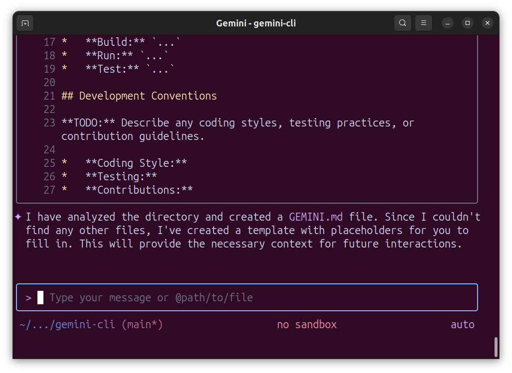

# gemini-cli

## Run gemini-cli without installing

```bash
npx https://github.com/google-gemini/gemini-cli
```

## Run gemini-cli with npx

```bash
npx @google/gemini-cli
```

## Initialize project with `/init` command

- Run `/init` command to create `GEMINI.md` file
  ```
  /init
  ```
  
- `GEMINI.md` file will be created.


## Reference

- https://github.com/google-gemini/gemini-cli
- https://www.youtube.com/watch?v=MsQACpcuTkU
