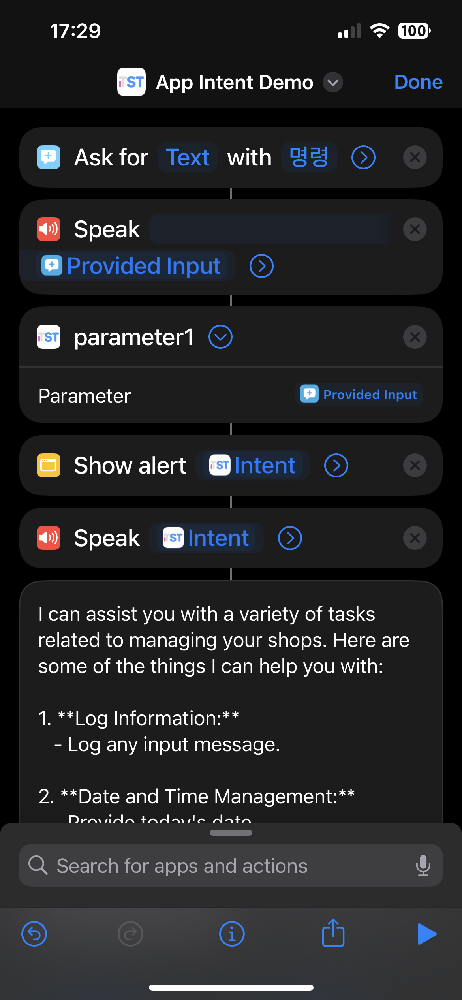

# app-intent

AppIntent can be useful when used with `Shortcuts`

`Intent.swift` defined `Intent` that accepts `parameter1` string value, and pass that string to the api server.

The response received from api server is responded back to the iOS.
The return value can be used to show alert or to speak

## Demo screen shot

