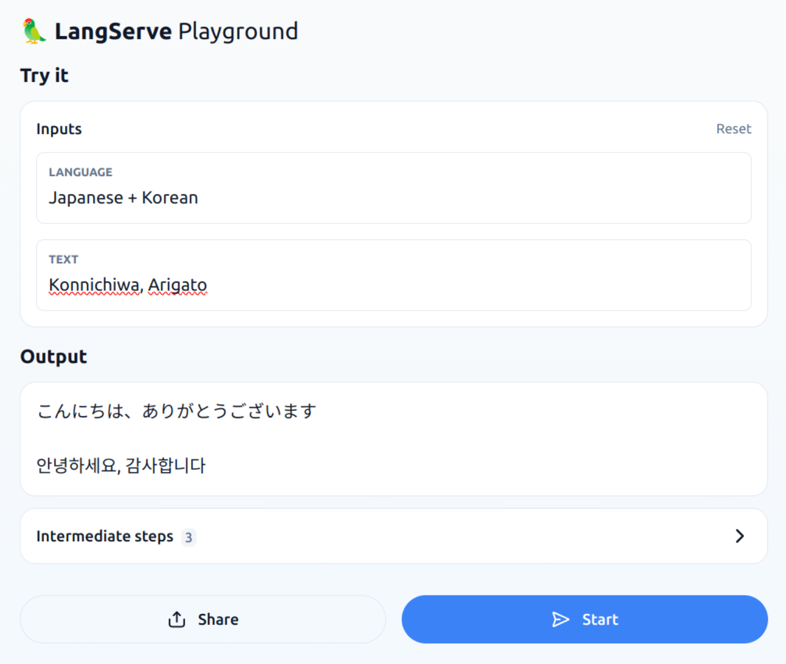

# first

## cli example

- run

```
python -m first
```

- output

```
안녕하세요, 어떻게 지내세요?
```

## api server example

```
python -m api_server
```

- access : http://0.0.0.0:8000/playground/

- output



## Reference

- https://python.langchain.com/v0.2/docs/tutorials/llm_chain/
