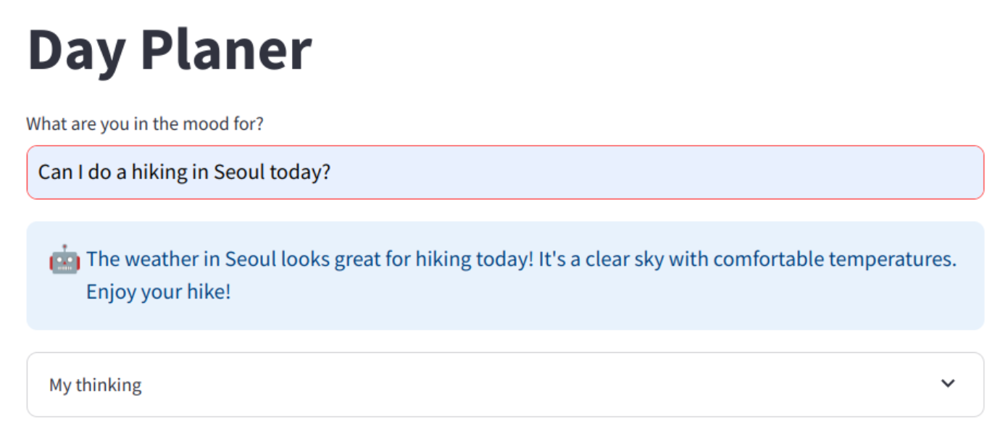

# tool_chain

## Run

- run
    ```bash
    streamlit run dayplanner.py
    ```
- open browser : http://localhost:8501/
- response example
  

## Reference

- https://github.com/Apress/Building-Generative-AI-Powered-Apps/blob/main/chapter_3/day_planner_agent.py
