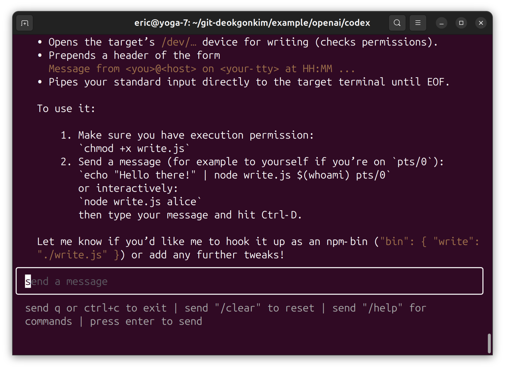

# test openai codex

- set OPENAI_API_KEY
  ```bash
  export OPENAI_API_KEY=[REDACTED]
  ```
- run codex
  ```bash
  npx codex
  ```
- Write a command
  ```
  Create `write`(on linux) like program using nodejs
  ```
- VOILA!
  
  
  

- Run and test program generated by `codex`
  ```bash
  node write.js dgkim
  ```
  
  


## Reference

- https://github.com/openai/codex
